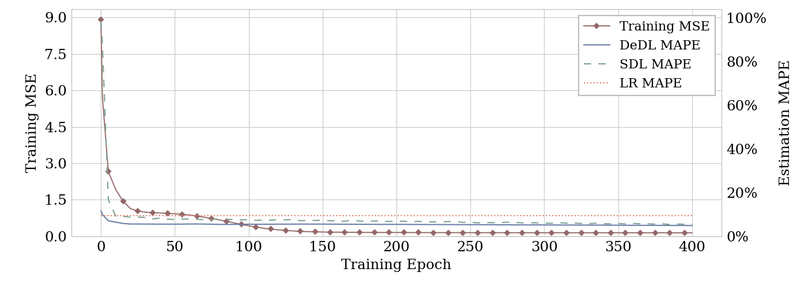

# DeDL: Figure 7 with synthetic data

This repository reproduces the training-epoch comparison in [Ye et al., *Management Science*](https://rphilipzhang.github.io/rphilipzhang/DeDL-nonblind.pdf) with generated data. The **TensorFlow four-fold aggregate** is the primary result. Platform O's private data and exact published curve are unavailable.



[Figure PDF](examples/tensorflow/figure7_fourfold.pdf)

## Experiment

- 20,000 users; observed treatment combinations `000`, `001`, `010`, `100`, `111`. The other three combinations have no outcomes in training or scoring data.
- Ten independent uniform continuous covariates and 16 independently sampled categorical covariates. The latter become 77 one-hot columns: 87 DNN inputs in total. Column names and widths follow the [public notebook's `xvar` list](https://github.com/zikunye2/deep_learning_based_causal_inference_for_combinatorial_experiments/blob/main/main.ipynb); they are **not** a literal encoding of the empirical categories in [Online Appendix Table A1](https://rphilipzhang.github.io/rphilipzhang/DeDL-nonblind_Appendix.pdf). Their synthetic distribution is our choice, and they do not affect the outcome. There is no trainable embedding layer.
- Fixed sigmoid response with known coefficients and uniform noise of half-width 0.5; [response parameters](response_parameters.json) and [feature schema](feature_schema.json) specify the generator. Independent Monte Carlo integration supplies population ATE references.
- Two 20–20–20 ReLU branches; Adam learning rate `0.0001`; batch size 100; 400 epochs; DeDL ridge `0.0005`. Each scoring fold is held out from fitting, and 10% of the other users are reserved for validation.
- MAPE uses the fixed five treatment combinations with reported APE in the paper's Table 2: `001`, `100`, `111`, `101`, `011`. All seven nonbaseline combinations are still estimated. The left axis displays validation MSE under the paper's “Training MSE” terminology.

The response coefficients, covariate distribution, noise, reference population, inner validation split, and ridge are synthetic choices. [Configuration differences](docs/DIFFERENCES.md) distinguish paper settings from project choices.

## TensorFlow four-fold results

Each row is evaluated at epoch 400. The aggregate pools fold ATE estimates by scoring-fold size **before** calculating MAPE and MAE; it is not the mean of the fold errors. MAPE is in percent.

| Scoring fold | Validation MSE | DeDL MAPE | SDL MAPE | LR MAPE | DeDL MAE | SDL MAE |
|---|---:|---:|---:|---:|---:|---:|
| 0 | 0.15071 | 5.102% | 5.932% | 9.582% | 0.13815 | 0.16250 |
| 1 | 0.13605 | 4.678% | 5.085% | 9.562% | 0.13488 | 0.14781 |
| 2 | 0.13780 | 5.107% | 5.914% | 9.251% | 0.13783 | 0.15239 |
| 3 | 0.14141 | 5.251% | 5.587% | 9.319% | 0.15016 | 0.15399 |
| **Four-fold aggregate** | **0.14149** | **4.882%** | **5.471%** | **9.388%** | **0.13800** | **0.14984** |

Complete measurements: [aggregate checkpoints](examples/tensorflow/aggregate_curve.csv), [fold-level ATEs](examples/tensorflow/fold_final_ates.csv), and [aggregate ATEs](examples/tensorflow/final_ates.csv). Both the true and estimated best treatment are `101`.

The PyTorch **four-fold aggregate** gives DeDL 4.853%, SDL 5.455%, and LR 9.388% MAPE. Its [curve](examples/pytorch/aggregate_curve.csv) and [ATEs](examples/pytorch/final_ates.csv) are included as a framework check. A short [input-feature comparison](examples/feature_comparison.csv) is retained as an auxiliary result.

## Reproduce

```bash
git clone https://github.com/ChiQt/DeDL_replication.git
cd DeDL_replication
```

Run the backends in separate Python environments and sequentially so they can reuse the same generated data. Each command trains four folds by default.

```bash
conda create -n dedl-tf python=3.10 -y
conda activate dedl-tf
python -m pip install -r requirements-tensorflow.txt
python run_tensorflow.py
```

The main PDF is `outputs/tensorflow/figure7_fourfold.pdf`. A complete TensorFlow run took about 9 minutes on the tested server, excluding environment setup.

```bash
conda create -n dedl-pt python=3.11 -y
conda activate dedl-pt
python -m pip install torch==2.8.0 --index-url https://download.pytorch.org/whl/cpu
python -m pip install -r requirements-pytorch.txt
python run_pytorch.py
```

The PyTorch PDF is `outputs/pytorch/figure7_fourfold.pdf`. To redraw the saved TensorFlow measurements without training:

```bash
python -m pip install -r requirements-plot.txt
python plot_figure7.py --curve examples/tensorflow/aggregate_curve.csv --output outputs/preview/figure7_fourfold.pdf
```

Use a new `--output-dir` and `--data-dir` after changing the configuration. Generated datasets and run outputs stay local.

## Code map / 代码结构

| Path | Role / 作用 |
|---|---|
| `run_tensorflow.py`, `run_pytorch.py` | Independent training entry points / 独立训练入口 |
| `configs/figure7.json` | Numerical settings / 数值配置 |
| `feature_schema.json`, `response_parameters.json` | Generator specification / 生成机制 |
| `dedl/data.py` | Data, reference effects, splits / 数据、真值、划分 |
| `dedl/tf_model.py`, `dedl/torch_model.py` | Structured networks / 网络实现 |
| `dedl/estimators.py` | SDL, DeDL, LR and metric checks / 估计与指标 |
| `dedl/runner.py`, `dedl/plotting.py` | Training and figures / 训练与绘图 |
| `docs/CODE_GUIDE.md` | Formula and output walkthrough / 公式与输出解读 |

TensorFlow adapts the authors' public network builder; the complete data and estimation pipeline is organized here. Run checks with `python -m unittest discover -s tests -v`. [Attribution](THIRD_PARTY.md) and the [main paper](https://rphilipzhang.github.io/rphilipzhang/DeDL-nonblind.pdf), [Online Appendix](https://rphilipzhang.github.io/rphilipzhang/DeDL-nonblind_Appendix.pdf), and [public code](https://github.com/zikunye2/deep_learning_based_causal_inference_for_combinatorial_experiments) document the sources.
